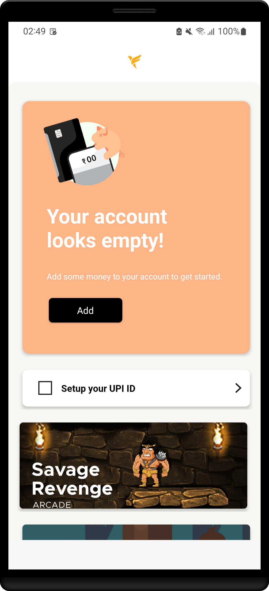
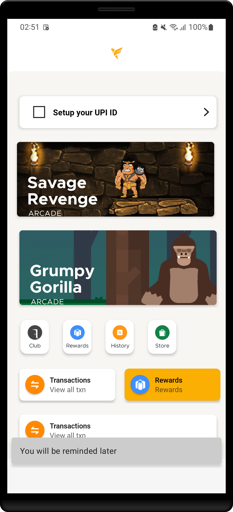
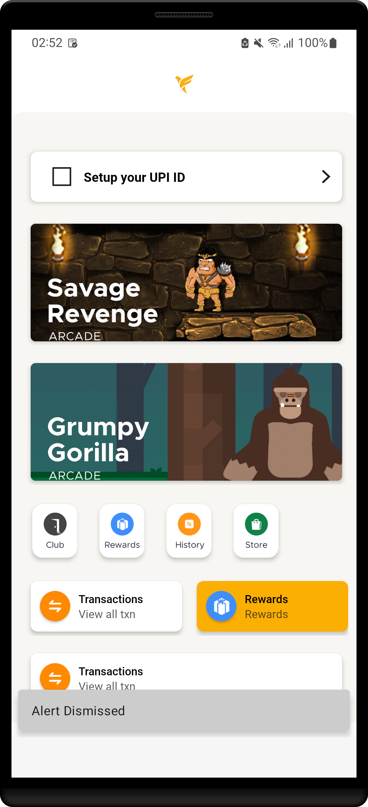
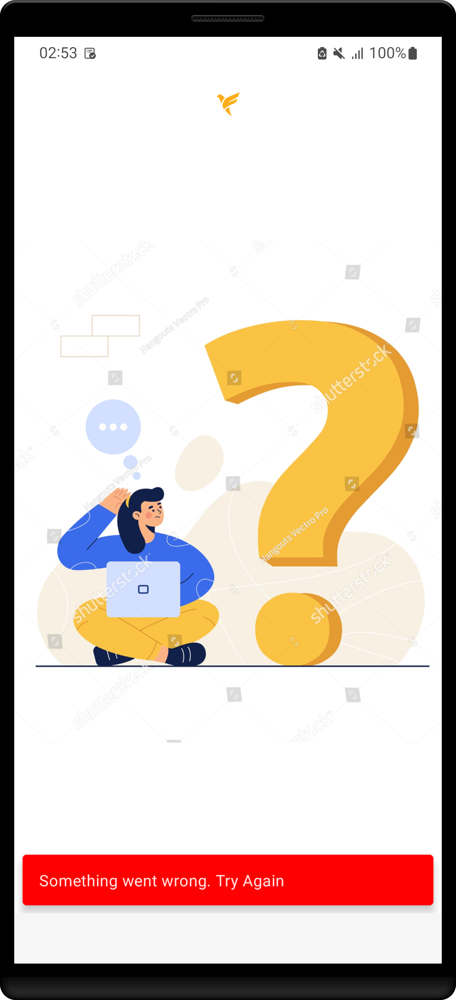

# Server Driven Ui App
## Description

This app uses server driven approach for its UI implementation. It means UI implementation is not stored on android source code but rather received dynamically from backend. It uses clean MVVM Architecture with modern libraries like epoxy, retrofit, glide, hilt and lottie. Dynamic view are inflated using epoxy recycler view with databinding enabled. Network calls are made using retrofit library. Glide is used for image loading. Hilt is used for dependency injection and lottie is used for animation. The app follows Airbnb's server driven UI approach for different platforms.

## Application Screenshots

* Home Screen:

   

      &nbsp; &nbsp; &nbsp; &nbsp; &nbsp;
     
   

* HC3 Card Long Pressed:

   

   &nbsp; &nbsp; &nbsp; &nbsp; &nbsp;
  

  
* HC3 Remind Later Pressed: On tapping "remind later" action on a card, it should be removed from the display. This card should be shown on the next app start.

  

   &nbsp; &nbsp; &nbsp; &nbsp; &nbsp;
  

  
* HC3 Dismiss now Pressed: On tapping "dismiss now" action, it should be removed from the display. This card should never be visible again. file:///home/aikansh_yadav/Downloads/server_driven_ui_app.mov

  

   &nbsp; &nbsp; &nbsp; &nbsp; &nbsp;
  

  
* No Internet Error: 

  

   &nbsp; &nbsp; &nbsp; &nbsp; &nbsp;
  

## Sample Video

https://user-images.githubusercontent.com/87969632/186744794-9e2a2b4e-0dde-4110-8260-de1d9df9b1fe.mp4

## Current progress at the time of Submission

All expected deliverables have been completed and no issue except text wrapping in one of the layout has been found as of yet.
  
## Code Structure

The application is created mainly by keeping Clean Code MVVM Architecture into our point of vision.

Different layers of the project: 

- **Data layer:** The data layer is made of repositories that each can contain zero to many data sources. In our case we have only one data source.

- **Domain layer:** This layer is responsible for connecting presentation layer with the data layer. It contains use usecases and repositories.

- **Presentation layer:** The UI layer provides the UI implementation of the application. This layer internally implements MVVM (Model-View-ViewModel) architecture. It contains various fragments/activities, viewmodel and controller for the data.

## Package Structure

      com.example.fampayassignmentapp  # Root Package
      
      ├── commons                      # Contains common classes and util classes.
      ├── data                         # For data handling.
      │   ├── interceptor              # Contains header interceptor which intercepts retrofit calls and header.
      │   ├── remote                   # It contains service class and response class
      │   └── repository               # Defining the FampayRepo implementation class
      |
      ├── di                           # Dependency Injection module classes.  
      |
      ├── domain                       # Acts as an intermediator between presentation layer and data layer
      │   ├── models                   # Contains model class required for inflating views.
      │   ├── preferences              # Contains sharedPreferences implementation of remind me and dismiss card functionality.
      │   ├── repository               # Defining interface for FampayRepo.
      │   └── usecase                  # Contains get card group use case.
      │
      │
      ├── presentation                 # Implements UI functionalities.
      │   ├── home                     # Contains HomeFragment and HomeViewModel responsible for displaying content.
      │   └── MainActivity             # MainActivity which contains HomeFragment.
      |
      └── MyApp                        # Application class for initialising application.
      
## Technologies and Libraries

- [Kotlin](https://kotlinlang.org/) - Official programming language for Android development.
- [Android Architecture Components](https://developer.android.com/topic/libraries/architecture) - Collection of libraries that help you design robust, testable, and maintainable apps. Thus they help us to separate business logic apart from the UI logic and helps us in designing proper architecture.
  - [LiveData](https://developer.android.com/topic/libraries/architecture/livedata) - Data objects that notify views when the underlying database changes.
  - [ViewModel](https://developer.android.com/topic/libraries/architecture/viewmodel) - Stores UI-related data that isn't destroyed on configuration changes. 
  - [DataBinding](https://developer.android.com/topic/libraries/data-binding) - The Data Binding Library is a support library that allows you to bind UI components in your layouts to data sources in your app using a declarative format rather than programmatically.
  - [ViewBinding](https://developer.android.com/topic/libraries/view-binding) - View binding is a feature that allows you to more easily write code that interacts with views.
- [Epoxy](https://github.com/airbnb/epoxy) - Epoxy is an Android library for building complex screens in a RecyclerView.
- [Retrofit](https://square.github.io/retrofit/) - Retrofit is a type-safe HTTP client for Android and Java – developed by Square (Dagger, Okhttp).
- [Glide](https://bumptech.github.io/glide/) - Glide is a fast and efficient image loading library for Android focused on smooth scrolling. Glide offers an easy to use API, a performant and extensible resource decoding pipeline and automatic resource pooling. 
- [Dependency Injection](https://developer.android.com/training/dependency-injection) - 
  - [Hilt](https://developer.android.com/training/dependency-injection/hilt-android) - Hilt is a dependency injection library for Android that reduces the boilerplate of doing manual dependency injection in your project. 
- [Swipe Refresh Layout](https://developer.android.com/jetpack/androidx/releases/swiperefreshlayout) - Implement the swipe-to-refresh UI pattern.
- [Lottie](https://github.com/airbnb/lottie-android) - Library that render After Effects animations

## Built With

* Android Studio

## Author
* <a href="https://github.com/aikansh2001yadav"> **Aikansh Yadav** </a>
